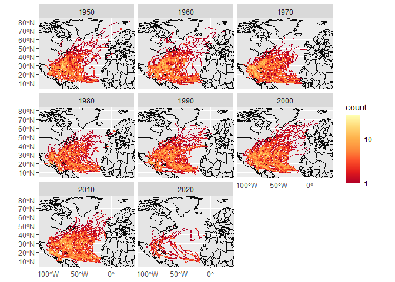

Cse study 09
================
Bowei Zhao
11/02/2020

## Plot the temporal trend of annual mean carbon dioxide concentrations

<!-- -->

## Show the annual mean carbon dioxide concentrations in the last five years

    ## although coordinates are longitude/latitude, st_intersects assumes that they are planar
    ## although coordinates are longitude/latitude, st_intersects assumes that they are planar

    ## `summarise()` ungrouping output (override with `.groups` argument)

<table class="table table-striped" style="margin-left: auto; margin-right: auto;">

<thead>

<tr>

<th style="text-align:left;">

state

</th>

<th style="text-align:right;">

storms

</th>

<th style="text-align:left;">

geometry

</th>

</tr>

</thead>

<tbody>

<tr>

<td style="text-align:left;color: red !important;">

Florida

</td>

<td style="text-align:right;color: red !important;">

82

</td>

<td style="text-align:left;color: red !important;">

MULTIPOINT ((-87.5 30.3), (…

</td>

</tr>

<tr>

<td style="text-align:left;">

North Carolina

</td>

<td style="text-align:right;">

62

</td>

<td style="text-align:left;">

MULTIPOINT ((-84 35.3), (-8…

</td>

</tr>

<tr>

<td style="text-align:left;">

Georgia

</td>

<td style="text-align:right;">

57

</td>

<td style="text-align:left;">

MULTIPOINT ((-85.51 34.94),…

</td>

</tr>

<tr>

<td style="text-align:left;">

Texas

</td>

<td style="text-align:right;">

53

</td>

<td style="text-align:left;">

MULTIPOINT ((-106.37 31.88)…

</td>

</tr>

<tr>

<td style="text-align:left;">

Louisiana

</td>

<td style="text-align:right;">

49

</td>

<td style="text-align:left;">

MULTIPOINT ((-94 32.7), (-9…

</td>

</tr>

</tbody>

</table>
