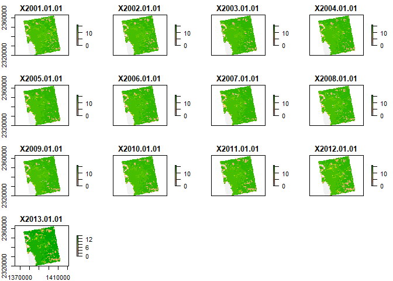
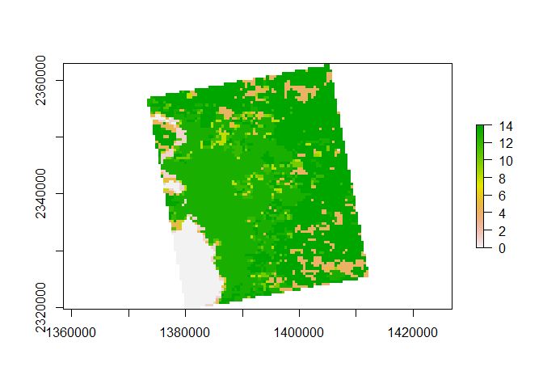

Case Study 10
================
Bowei Zhao
11/10/2020

``` r
library(raster)
library(rasterVis)
library(rgdal)
library(ggmap)
library(tidyverse)
library(knitr)
library(kableExtra)

# New Packages
library(ncdf4) # to import data from netcdf format
```

``` r
# Create afolder to hold the downloaded data
dir.create("data",showWarnings = F) #create a folder to hold the data

lulc_url="https://github.com/adammwilson/DataScienceData/blob/master/inst/extdata/appeears/MCD12Q1.051_aid0001.nc?raw=true"
lst_url="https://github.com/adammwilson/DataScienceData/blob/master/inst/extdata/appeears/MOD11A2.006_aid0001.nc?raw=true"

# download them
download.file(lulc_url,destfile="data/MCD12Q1.051_aid0001.nc", mode="wb")
download.file(lst_url,destfile="data/MOD11A2.006_aid0001.nc", mode="wb")
```

## Explore LULC data

``` r
# Load data into R
lulc=stack("data/MCD12Q1.051_aid0001.nc",varname="Land_Cover_Type_1")
lst=stack("data/MOD11A2.006_aid0001.nc",varname="LST_Day_1km")

plot(lulc)
```

<!-- -->

``` r
lulc=lulc[[13]]
plot(lulc)
```

<!-- -->

``` r
# Process Land Cover Data
Land_Cover_Type_1 = c(
    Water = 0, 
    `Evergreen Needleleaf forest` = 1, 
    `Evergreen Broadleaf forest` = 2,
    `Deciduous Needleleaf forest` = 3, 
    `Deciduous Broadleaf forest` = 4,
    `Mixed forest` = 5, 
    `Closed shrublands` = 6,
    `Open shrublands` = 7,
    `Woody savannas` = 8, 
    Savannas = 9,
    Grasslands = 10,
    `Permanent wetlands` = 11, 
    Croplands = 12,
    `Urban & built-up` = 13,
    `Cropland/Natural vegetation mosaic` = 14, 
    `Snow & ice` = 15,
    `Barren/Sparsely vegetated` = 16, 
    Unclassified = 254,
    NoDataFill = 255)

lcd=data.frame(
  ID=Land_Cover_Type_1,
  landcover=names(Land_Cover_Type_1),
  col=c("#000080","#008000","#00FF00", "#99CC00","#99FF99", "#339966", "#993366", "#FFCC99", "#CCFFCC", "#FFCC00", "#FF9900", "#006699", "#FFFF00", "#FF0000", "#999966", "#FFFFFF", "#808080", "#000000", "#000000"),
  stringsAsFactors = F)
# colors from https://lpdaac.usgs.gov/about/news_archive/modisterra_land_cover_types_yearly_l3_global_005deg_cmg_mod12c1
kable(head(lcd))
```

<table>

<thead>

<tr>

<th style="text-align:left;">

</th>

<th style="text-align:right;">

ID

</th>

<th style="text-align:left;">

landcover

</th>

<th style="text-align:left;">

col

</th>

</tr>

</thead>

<tbody>

<tr>

<td style="text-align:left;">

Water

</td>

<td style="text-align:right;">

0

</td>

<td style="text-align:left;">

Water

</td>

<td style="text-align:left;">

\#000080

</td>

</tr>

<tr>

<td style="text-align:left;">

Evergreen Needleleaf forest

</td>

<td style="text-align:right;">

1

</td>

<td style="text-align:left;">

Evergreen Needleleaf forest

</td>

<td style="text-align:left;">

\#008000

</td>

</tr>

<tr>

<td style="text-align:left;">

Evergreen Broadleaf forest

</td>

<td style="text-align:right;">

2

</td>

<td style="text-align:left;">

Evergreen Broadleaf forest

</td>

<td style="text-align:left;">

\#00FF00

</td>

</tr>

<tr>

<td style="text-align:left;">

Deciduous Needleleaf forest

</td>

<td style="text-align:right;">

3

</td>

<td style="text-align:left;">

Deciduous Needleleaf forest

</td>

<td style="text-align:left;">

\#99CC00

</td>

</tr>

<tr>

<td style="text-align:left;">

Deciduous Broadleaf forest

</td>

<td style="text-align:right;">

4

</td>

<td style="text-align:left;">

Deciduous Broadleaf forest

</td>

<td style="text-align:left;">

\#99FF99

</td>

</tr>

<tr>

<td style="text-align:left;">

Mixed forest

</td>

<td style="text-align:right;">

5

</td>

<td style="text-align:left;">

Mixed forest

</td>

<td style="text-align:left;">

\#339966

</td>

</tr>

</tbody>

</table>

``` r
# convert to raster (easy)
lulc=as.factor(lulc)

# update the RAT with a left join
levels(lulc)=left_join(levels(lulc)[[1]],lcd)
```

``` r
# plot it
gplot(lulc)+
  geom_raster(aes(fill=as.factor(value)))+
  scale_fill_manual(values=levels(lulc)[[1]]$col,
                    labels=levels(lulc)[[1]]$landcover,
                    name="Landcover Type")+
  coord_equal()+
  theme(legend.position = "right")+
  guides(fill=guide_legend(ncol=1,byrow=TRUE))
```

<!-- -->

## Land Surface Temperature

``` r
plot(lst[[1:12]])
```

<!-- -->

``` r
# Covert LST to Degrees C
offs(lst)=-273.15
plot(lst[[1:10]])
```

<!-- -->

## Add Dates to Z (time) dimension

``` r
names(lst)[1:5]
```

    ## [1] "X2000.02.18" "X2000.02.26" "X2000.03.05" "X2000.03.13" "X2000.03.21"

``` r
tdates=names(lst)%>%
  sub(pattern="X",replacement="")%>%
  as.Date("%Y.%m.%d")

names(lst)=1:nlayers(lst)
lst=setZ(lst,tdates)
```

## Extract timeseries for a point

``` r
lw=SpatialPoints(data.frame(x= -78.791547,y=43.007211))
projection(lw) = "+proj=longlat"

lw = spTransform(lw, crs(lst))
extract_data =t(raster::extract(lst,lw,buffer=1000,fun=mean,na.rm=T))

extract_date = getZ(lst)
date_lst = cbind.data.frame(extract_date,extract_data)

ggplot(date_lst, aes(x = extract_date, y = extract_data)) + geom_point() +
  geom_smooth(n = 811, span = 0.05) + labs(x = "date", y = "Monthly Mean Land Surface Temperature")
```

<!-- -->

## Summarize weekly data to monthly climatologies

``` r
tmonth = as.numeric(format(getZ(lst),"%m"))
lst_month = stackApply(lst, indices = tmonth, fun = mean)
names(lst_month)=month.name
gplot(lst_month) + geom_tile(aes(fill = value)) + facet_wrap(~variable) +
  scale_fill_gradient2(low = "blue",mid = "white", high = "red", midpoint = 15) +
  theme(axis.text=element_blank())
```

<!-- -->

``` r
monthly_mean = cellStats(lst_month,mean)
kable(monthly_mean, col.names = c("Mean")) %>%  kable_styling(bootstrap_options = c("striped", "hover"))
```

<table class="table table-striped table-hover" style="margin-left: auto; margin-right: auto;">

<thead>

<tr>

<th style="text-align:left;">

</th>

<th style="text-align:right;">

Mean

</th>

</tr>

</thead>

<tbody>

<tr>

<td style="text-align:left;">

January

</td>

<td style="text-align:right;">

\-2.127506

</td>

</tr>

<tr>

<td style="text-align:left;">

February

</td>

<td style="text-align:right;">

8.710271

</td>

</tr>

<tr>

<td style="text-align:left;">

March

</td>

<td style="text-align:right;">

18.172077

</td>

</tr>

<tr>

<td style="text-align:left;">

April

</td>

<td style="text-align:right;">

23.173591

</td>

</tr>

<tr>

<td style="text-align:left;">

May

</td>

<td style="text-align:right;">

26.990005

</td>

</tr>

<tr>

<td style="text-align:left;">

June

</td>

<td style="text-align:right;">

28.840144

</td>

</tr>

<tr>

<td style="text-align:left;">

July

</td>

<td style="text-align:right;">

27.358260

</td>

</tr>

<tr>

<td style="text-align:left;">

August

</td>

<td style="text-align:right;">

22.927727

</td>

</tr>

<tr>

<td style="text-align:left;">

September

</td>

<td style="text-align:right;">

15.477510

</td>

</tr>

<tr>

<td style="text-align:left;">

October

</td>

<td style="text-align:right;">

8.329881

</td>

</tr>

<tr>

<td style="text-align:left;">

November

</td>

<td style="text-align:right;">

0.586179

</td>

</tr>

<tr>

<td style="text-align:left;">

December

</td>

<td style="text-align:right;">

\-4.754134

</td>

</tr>

</tbody>

</table>

## Summarize Land Surface Temperature by Land Cover

``` r
lulc2 = resample(lulc, lst, method="ngb")

lcds1=cbind.data.frame(
values(lst_month),
ID=values(lulc2[[1]]))%>%
na.omit()

lst_lulc = lcds1 %>% gather(key='month',value='value',-ID) %>%
  mutate(ID=as.numeric(ID), month=factor(month,levels=month.name,ordered=T)) %>%
  left_join(lcd, by = "ID") %>% filter(landcover%in%c("Urban & built-up","Deciduous Broadleaf forest"))

ggplot(lst_lulc, aes(x = month, y = value)) + geom_jitter() + facet_wrap(~landcover) +
  labs(x = "Month", y = "Monthly Mean Land Surface Temperature(C)", title = "Land Surface Temperature in Urban and Forest") +
  theme(axis.text.x = element_text(angle = 90)) + geom_violin(colour = "red", fill = "grey") +
  theme(plot.title = element_text(hjust = 0.5))
```

<!-- -->
